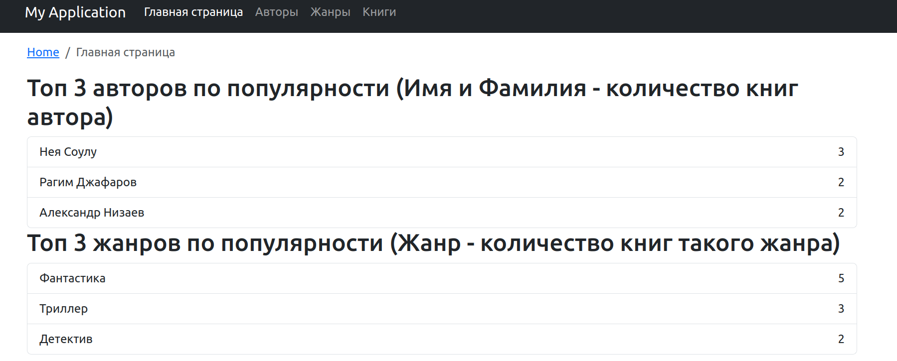
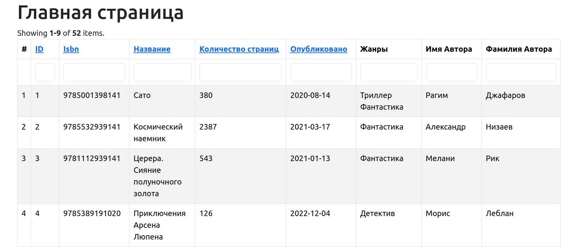
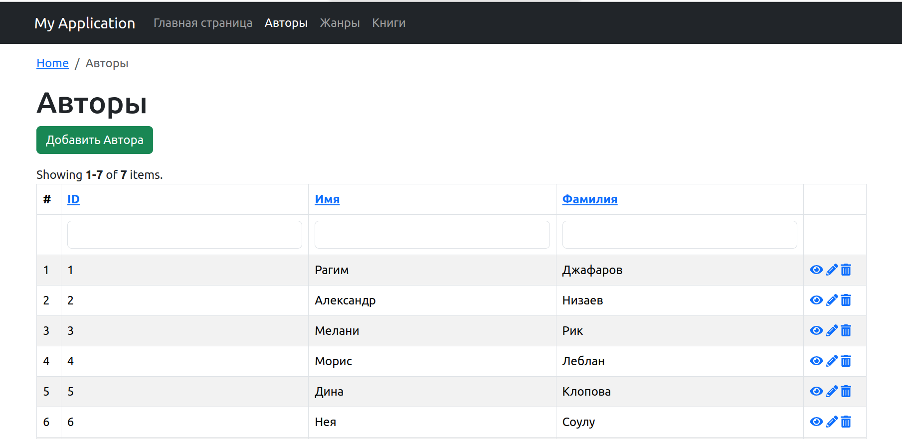
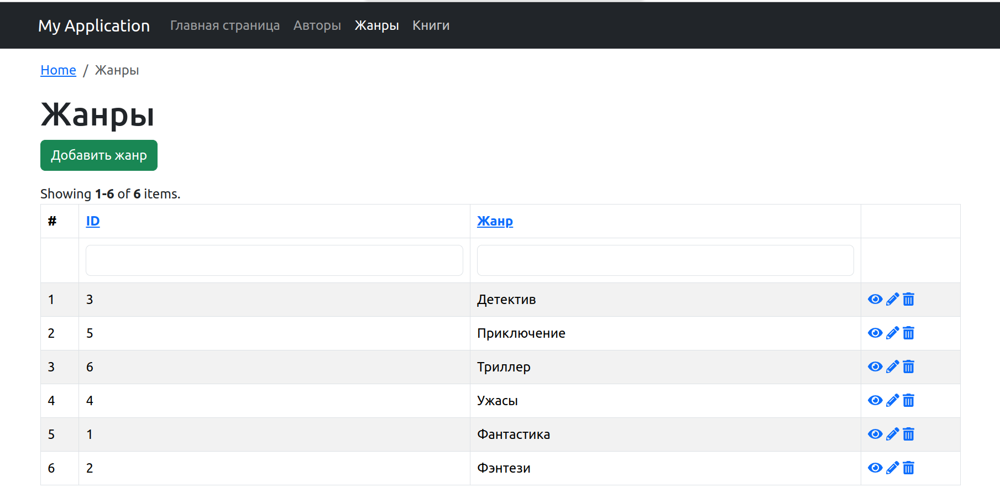
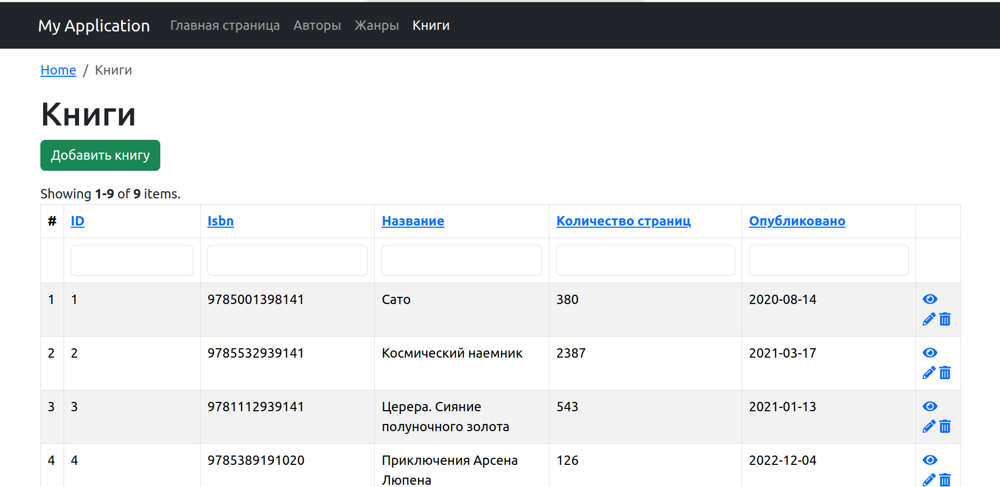
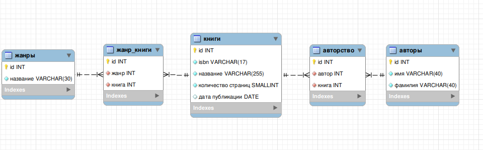

# tests_for_l_of_r

## Финальное задание

### 1. Изменить пароль в config/db.php на свой.
### 2. Запустить создание и заполнение таблицы library_fyodor с помощью SQL скрипта  create_DB.sql .
### 3. Запустить команду composer install .
### 4. Открыть http://localhost:8080/ .

#### Скриншот Топ 3 Авторов и Жанров

#### Скриншот Главной страницы

#### Скриншот страницы Авторы

#### Скриншот страницы Жанры

#### Скриншот страницы Книги

## Task 1

### 1. source task_1/create_DB.sql
### 2. source task_1/populate_DB.sql
### 3. source task_1/find_fantastic_genre.sql
### 4. source task_1/find_max_author.sql

## Task 2

### 0. Нужно изменить параметры в task_2/config.js на свои
### 1. source task_2/createDB.sql
### 2. cd task_2 && npm install
### 3. node app.js